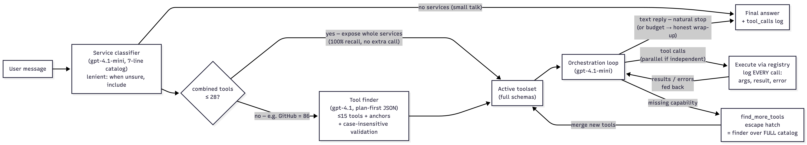

# Multi-Tool Agentic Orchestrator

An LLM agent that answers arbitrary user queries by routing over **191 tools across 7 services** (Gmail, Google Calendar, Google Drive, Slack, Linear, GitHub, Perplexity) and orchestrating multi-step workflows — built as my solution to the InstaLILY engineering case study (4-hour timed build).

**Design walkthrough (Loom, 5 min):** https://www.loom.com/share/9e22a699a24b41c8ba7f2cb08948f966 · **Full design doc:** [DESIGN.md](DESIGN.md) · **Original brief:** [CASE_STUDY.md](CASE_STUDY.md)

## Architecture



**Adaptive two-stage routing.** 191 full tool schemas is past the point where any model routes accurately, so the toolset the model sees is chosen per turn:

1. **Lenient service classifier** (gpt-4.1-mini) — picks every service *any step* of the request could plausibly need, from a 7-line capability catalog. Output is constrained to the 7 valid names by a strict JSON schema.
2. **Conditional finder** — if the selected services' combined tools fit under a threshold (≤28), all of them are exposed with full schemas: 100% recall, no extra LLM call. Only for big unions (GitHub alone is 86 tools) does a recall-biased finder (gpt-4.1) shortlist ≤15 tools using a plan-first structured output, plus **anchor tools** — curated enumeration primitives per service that always ride along as a deterministic recall floor.
3. **Escape hatch** — the loop always carries a `find_more_tools` meta-tool that re-runs the finder over the *full* catalog mid-conversation, so a routing miss (or a multi-step plan whose later steps only become knowable after earlier results) is a one-step recovery, never a dead end.

**Orchestration loop** (gpt-4.1-mini, OpenAI Responses API): the model calls tools (in parallel when independent), results and errors feed back, and every invocation is logged with arguments, result, and error. Stop logic: natural stop on a text reply, hard caps (8 iterations / 24 calls) that end in an honest wrap-up with tools disabled, a duplicate-call cache, and a per-tool failure limit. Behavior policy: resolve ambiguity with cheap read-only lookups before asking, ask exactly one clarifying question when genuinely ambiguous, and **never mutate a guessed target** or fabricate success.

## What I built vs. what was provided

- **Provided scaffold:** the FastAPI server, the 7 mock services and their fixtures, the tool registry, and the `/tools`, `/reset`, `/state` endpoints.
- **My work:** the `POST /chat` implementation — [backend/solution.py](backend/solution.py) and everything in [backend/helpers/](backend/helpers/) — plus the test suites in [backend/tests/](backend/tests/) (`test_solution_helpers.py`, `test_live_scenarios.py`) and [DESIGN.md](DESIGN.md).

```
backend/helpers/
├── router.py        # adaptive two-stage routing + find_more_tools escape hatch
├── orchestrator.py  # the tool-calling loop, logging, stop logic, breakers
├── prompts.py       # classifier / finder / policy prompts (frozen mock clock, ambiguity rules)
├── registry.py      # compact catalog, anchor tools, case-insensitive name resolution
├── llm.py           # Responses API wrapper, strict-JSON calls, token/cost telemetry
├── env.py           # dependency-free .env loader + per-stage model config
├── devtools.py      # CLI: run turns with latency/token/cost stats
└── run_prompts.py   # editable batch scenario runner
```

## Engineering details I'm proud of

- **Case-insensitive tool-name canonicalization** — the registry mixes `UPPER_SNAKE` and `lower_snake` names; smaller models normalize casing when repeating them, which silently dropped action tools from shortlists until resolution was made case-insensitive.
- **Mock-semantics corrections at the schema layer** — the GitHub search mocks match plain substrings, so the model's `is:open` habit produced confident wrong answers; corrective notes are injected into tool descriptions at render time (scaffold untouched).
- **Frozen-clock awareness** — fixtures live at Wed 2026-04-08 (America/New_York), read at runtime so "today" and "next week" resolve against the mock world, not the real date.
- **Per-stage model economics** — measured head-to-head: the finder gets gpt-4.1 (recall is the graded axis; the call is small and conditional, ~+$0.006/firing), the token-heavy loop stays on mini.
- **Observability** — every turn logs one telemetry line: duration, tools routed, tool/LLM calls, tokens, and estimated cost priced per-model.

## Results

- **11/11 live end-to-end scenario tests** — covering single-service lookups, cross-service pipelines, parallel reads, ambiguity (ask without mutating), multi-turn clarify-then-complete, error honesty, mutations verified via `/state`, and large-catalog GitHub routing.
- **69/69 fast unit tests** (plus the 11 live tests, gated behind `RUN_LIVE_TESTS=1` to keep CI deterministic).
- Typical scenario: **5–15s, 0–4 tool calls, $0.002–0.015**.

## Quickstart

```bash
cd backend && uv sync && cd ..
cp .env.example .env            # add your OPENAI_API_KEY

# run the server
./backend/.venv/bin/python -m uvicorn backend.main:app --port 8000

# ask it something
curl -s -X POST localhost:8000/chat -H 'content-type: application/json' \
  -d '{"messages":[{"role":"user","content":"What conversations do I have in Slack?"}]}'

# tests
./backend/.venv/bin/python -m unittest discover -s backend/tests -t .           # fast
RUN_LIVE_TESTS=1 ./backend/.venv/bin/python -m unittest backend.tests.test_live_scenarios -v  # live

# dev harness: any prompt, with latency + cost stats
./backend/.venv/bin/python -m backend.helpers.devtools "What open pull requests are there right now?"
```
